# OODA Loop Workflow & Semantic Flow

This document describes how the Slack MCP Server implements the OODA (Observe-Orient-Decide-Act) loop pattern for intelligent workspace interaction, including detailed flow diagrams and user personality interactions.

## Overview

The OODA loop creates a continuous cycle of awareness and response:
- **Observe**: Gather information about the workspace state
- **Orient**: Understand context and analyze what's important
- **Decide**: Plan appropriate actions based on context
- **Act**: Execute responses and monitor results

## User Personality & Semantic Flow

The server implements "self-deprecating tools" that guide users toward better alternatives. Each tool provides semantic suggestions for the next logical action, creating a natural workflow while allowing creative flexibility.


## Complete OODA Loop Flow

```mermaid
graph LR
    subgraph "🔍 OBSERVE"
        O1[check-unreads<br/>What needs attention?]
        O2[list-channels<br/>Available channels]
        O3[check-my-mentions<br/>Personal mentions]
    end
    
    subgraph "🎯 ORIENT"
        OR1[catch-up-on-channel<br/>Channel context]
        OR2[Enhanced check-unreads<br/>Read actual messages]
        OR3[Count-based windowing<br/>1-3: Full<br/>4-15: Urgency<br/>16-50: Summary<br/>50+: Overview]
    end
    
    subgraph "🤔 DECIDE"
        D1[decide-next-action<br/>Basic reflection]
        D2[pace-conversation<br/>Timing analysis]
        D3[Context evaluation<br/>Priority assessment]
    end
    
    subgraph "⚡ ACT"
        A1[write-message<br/>Send response]
        A2[find-discussion<br/>Deep exploration]
        A3[mark-as-read<br/>Clear unreads]
    end
    
    O1 --> OR2
    O2 --> OR1
    O3 --> OR1
    OR1 --> D1
    OR2 --> D1
    OR3 --> D1
    D1 --> A1
    D2 --> A1
    D3 --> A2
    A1 --> O1
    A2 --> A3
    A3 --> O1
    
    style O1 fill:#e1f5ff,stroke:#0288d1
    style O2 fill:#e1f5ff,stroke:#0288d1
    style O3 fill:#e1f5ff,stroke:#0288d1
    style OR1 fill:#fff3e0,stroke:#f57c00
    style OR2 fill:#fff3e0,stroke:#f57c00
    style OR3 fill:#fff3e0,stroke:#f57c00
    style D1 fill:#f3e5f5,stroke:#7b1fa2
    style D2 fill:#f3e5f5,stroke:#7b1fa2
    style D3 fill:#f3e5f5,stroke:#7b1fa2
    style A1 fill:#e8f5e9,stroke:#388e3c
    style A2 fill:#e8f5e9,stroke:#388e3c
    style A3 fill:#e8f5e9,stroke:#388e3c
```



## Transaction Flow Diagram


## Semantic Flow Examples

### Example 1: Morning Check-in (Proactive Flow)


### Example 2: Topic Search (Creative Flow)


## Conversation Pacing States


## Key Design Patterns

### 1. Self-Deprecating Tools
Tools recommend better alternatives when available:
- `decide-next-action` → suggests specialized reasoning tools
- Basic tools → suggest semantic workflows
- Fallback options → promote optimal paths

### 2. Count-Based Message Windowing
Intelligent content display based on volume:
- **1-3 messages**: Full consumption = auto-mark read
- **4-15 messages**: Thorough review = auto-mark read
- **16-50 messages**: Triage only = preserve unread
- **50+ messages**: Surface scan = preserve unread

### 3. Non-Blocking Conversation Pacing
Using thinking time instead of delays:
```
pace-conversation → "Think about: [focus]" → Natural pause
```

### 4. Two-Phase Channel Caching
Fast startup with progressive loading:
1. **Phase 1**: Member channels (immediate)
2. **Phase 2**: All workspace channels (background)

## Implementation Notes

### Channel Security
- Channel IDs never exposed to AI
- All resolution through cached mappings
- Names used in all tool interfaces

### Semantic Continuity
Each tool provides `nextActions` with pre-filled parameters:
```json
{
  "nextActions": [
    "catch-up-on-channel channel='general' since='1h'",
    "find-discussion threadId='C123:456.789'",
    "write-message channel='general' threadTs='456.789'"
  ]
}
```

### Error Recovery
- Cache misses trigger API fallback
- Rate limits handled with backoff
- Stale cache detection and refresh

## Workflow Customization

Agents can customize their approach:

1. **Efficiency Mode**: Skip decide phase, direct tool chains
2. **Thorough Mode**: Full OODA cycle for every interaction  
3. **Monitor Mode**: Observe-Orient loop without acting
4. **Batch Mode**: Process multiple channels before acting

The semantic flow supports all modes while gently guiding toward optimal patterns.