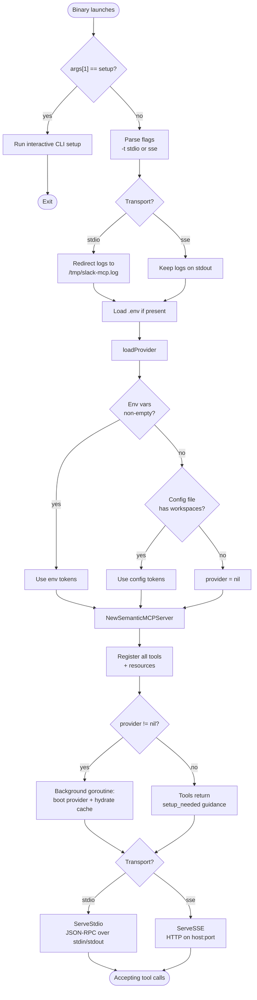
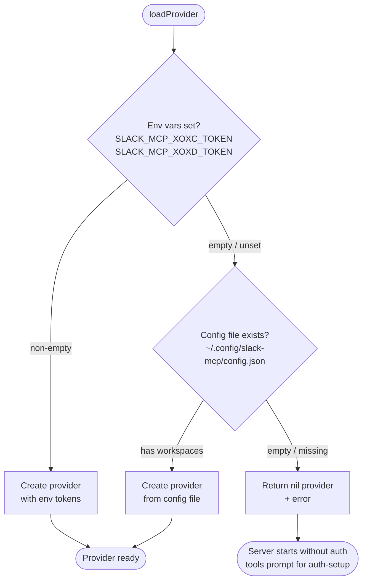
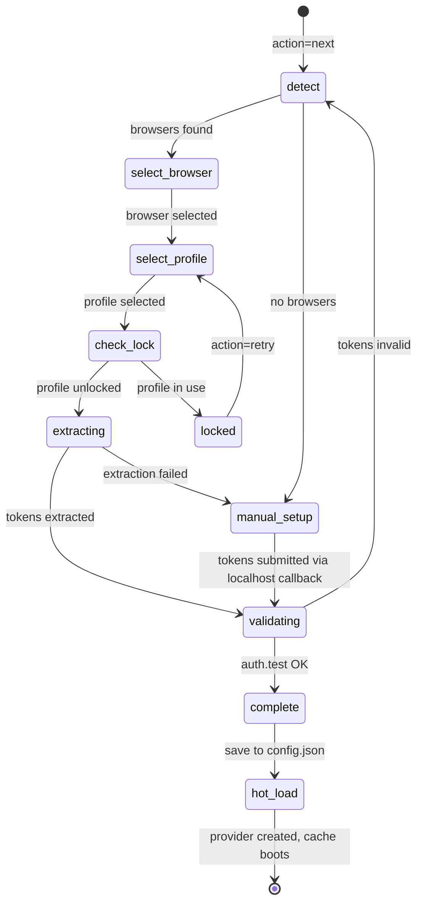
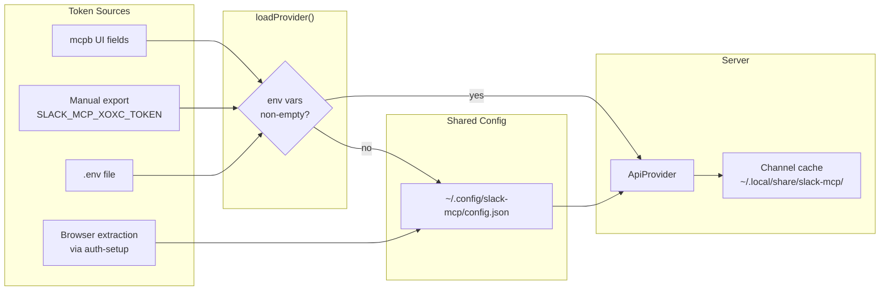
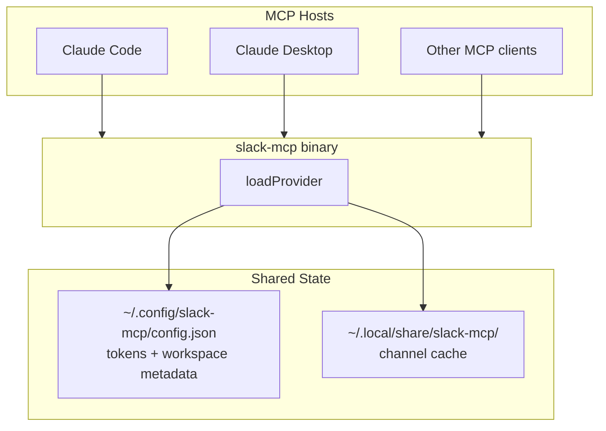

# Token Resolution Flow

How slack-mcp resolves credentials across MCP hosts (Claude Desktop, Claude Code, etc.).

## Process Startup

## Token Resolution

## Auth-Setup State Machine

## Token Sources and Persistence

## Cross-Host Sharing

All MCP hosts share the same config file. Setup once, use everywhere.

